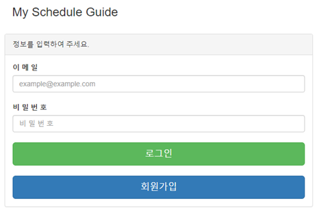
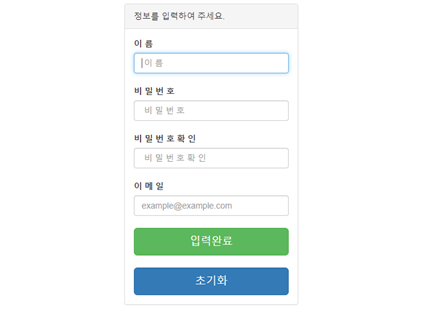
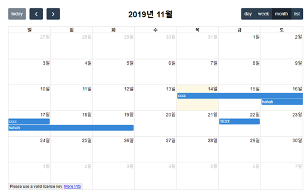
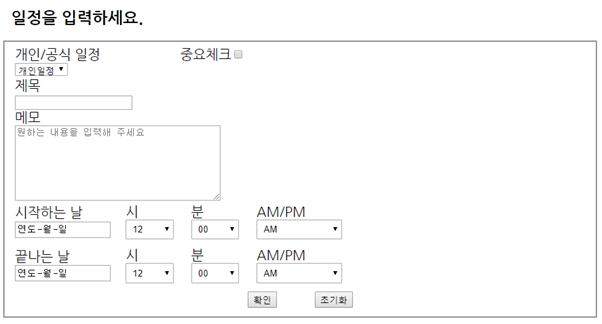
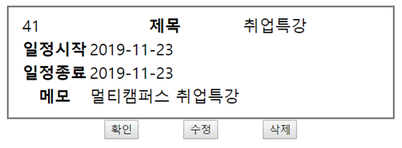

# My Schedule Guide (MSG)

#### 2019.11.15 ~ 2019.11.18

---

### ----- 프로젝트 계획서 -----

- **개요**

> 한국 사회가 빠름 빠름의 대명사인 건 모두가 아는 사실이다. 이와 같은 바쁜 생활 속에서 살아가다 보면 매너리즘에 빠지기 쉽고, 중요한 일을 잊어버리거나 사적인 일을 깜빡하는 경우도 상당히 많다. 
>
> 그래서 우리는 이러한 지루한 삶에 조금이라도 사는 맛을 더하고자 MSG 개발에 돌입한다.

- **배경 & 목적**

>이미 같은 종류의 프로그램이 많이 존재하지만, 내가 직접 개발하고 구현하여 개발 경험을 쌓는다.
>
>특별한 기능을 추가하여 기존 유사 프로그램과의 차이를 둔다.

---

- **구조 & 디자인**

> - **메인화면 :**
> 	- 로그인 창(box)을 만들어 이메일과 비밀번호 작성 란을 구성.
>   - 창 하단에 로그인 버튼과 회원가입 버튼 구성.
>   - 로그인 버튼을 클릭 시 달력 화면으로 이동.
>   - 회원가입 버튼을 클릭 시 개인정보를 등록하는 가입 화면으로 이동.

> - **달력화면 :**
>   - 화면 정 중앙에 80%비율의 공간을 차지하는 달력 생성.
>   - 달력 좌측 상단에 이전 달과 다음 달로 이동할 수 있는 버튼 구성.
>   - 달력 중앙 상단에 년&월 구성.
>   - 우측 상단에 일별, 주별, 월별 스케줄 그리고 현재 등록되어 있는 스케줄 확인 버튼 구성.
>   - 긴 일정을 한눈에 파악할 수 있게 하는 색상을 이용한 범주기능 구성.

> - **간편 기능 추가 :**
>   - 달력 화면에서 원하는 날짜를 클릭 시.
>   - 해당 일에 작성되어 있는 스케줄을 팝업창으로 띄우게 구현.
>   - 확인, 수정, 취소 기능 버튼을 구성.
>

> - **일정등록 화면 :**
>   - 개인/공식 일정과 설정과 중요일정인가를 확인하는 체크박스 구성.
>   - 일정 제목, 메모 구성.
>   - 일시 등록에는 시작하는 날과 끝나는 날을 구성.
>   - 두 기능을 년, 월, 일, 시, 분, AM, PM을 모두 설정이 가능하게 구성.

> - **DB관련 기능 :**
>   - 모든 기능에서의 정보 수집/등록과 저장/삭제는 가상 DB를 사용.

---

---

---

### ----- 프로젝트 기술소개서 -----

- **사용환경**
  - 스프링

- **웹 서비스 구현**

1. **프로젝트 주제 및 기능**
   - **프로젝트 주제:** 
     - 스케줄 관리 프로그램 (My Schedule Guide - MSG)
   - **프로젝트 구성:** 
     - **구성:** MVC 모델
     - **사용기술:** java, javascript, css, Html, database 등
     - **사용 소프트웨어:** Spring, Oracle, Docker
   - **프로젝트 기능:**
     - 회원 별 개인 스케줄 저장 및 열람
     - 월별, 주간별 등 기간 별 스케줄 조회 가능
     - 중요 일정 설정

---

2. **로그인 화면 및 기능 구성**

- **로그인 화면 및 기능**
  - 회원정보 입력 화면(이메일, 비밀번호) 생성
  - 로그인 성공 시 캘린더 화면으로 이동
  - 회원가입 버튼 클릭하였을 시 회원가입 화면으로 이동
  - Member DB에 저장되어 있는 정보와 로그인 창에 입력한 정보를 매칭 후 검사하여 로그인 기능을 수행할 계획이었으나 구현하지 못하였음

---

- **회원가입 화면 및 기능**
  - 회원가입에 필요한 정보(이름, 비밀번호, 이메일) 입력 창 생성
  - 유저가 비밀번호 입력에 실수가 없는지 확인하기 위해 비밀번호 확인 입력란을 추가하였음
  - 모든 정보를 입력한 뒤 입력완료 버튼을 클릭하면 Member DB에 정보가 저장되고 로그인 화면으로 이동함
  - 초기화 버튼을 클릭할 경우 입력 창에 들어있던 정보들이 지워짐
  - 각 입력 정보 별로 유효성 검사(중복검사, 형식검사) 기능을 추가할 예정이었으나 구현하지 못하였음

- 회원가입과 로그인 입력 창에 부트스트랩 라이브러리를 적용하였음

---

3. **메인(캘린더)화면 및 기능**

- **월별 캘린더 화면 및 기능**
  - 로그인 성공 시 저장된 일정(Schedule DB에 저장)이 로드되어 캘린더에 적용됨
  - 우측 버튼(day, week, month, list)를 통해 일별, 주별, 월별. 일정 목록 별로 일정 확인이 가능함
  - 좌측 상단 버튼(< >)을 이용하여 페이지 이동 가능
  - 월별 캘린더에서 날짜 칸을 클릭할 시 일정 등록 팝업창이 뜸, 확인을 클릭하면 일정 등록 페이지로 이동함
  - 등록한 일정(파란색으로 표시됨)을 클릭할 경우 해당 일정에 대한 상세 내용을 확인할 수 있는 팝업창이 실행됨
- ***캘린더 화면은 ‘fullcalendar’ 오픈소스(https://fullcalendar.io/)를 활용함***

---

4. **작성화면 및 기능 구성**

- **작성화면 및 기능**
  - form 태그를 사용하여 입력 정보를 controller(Homecontroller.java)에서 전달받아 처리할 수 있도록 구현함
  - 제목, 시작하는 날, 끝나는 날은 필수로 입력하도록 데이터베이스(Schedule DB Table)에 설정하였음
  - 확인을 클릭할 시에 입력한 정보가 데이터베이스(Schedule DB Table)에 저장됨

---

5. **조회화면 및 기능 구성**

- **조회화면 및 기능**
  - 월별 캘린더 화면(3.)에서 등록된 일정(파란색 블록)을 클릭할 경우 Schedule id값을 컨트롤러에 전달하여 해당 id값의 상세 일정을 조회할 수 있도록 구현함
  - 확인을 클릭할 경우 팝업 페이지가 종료됨

---

---